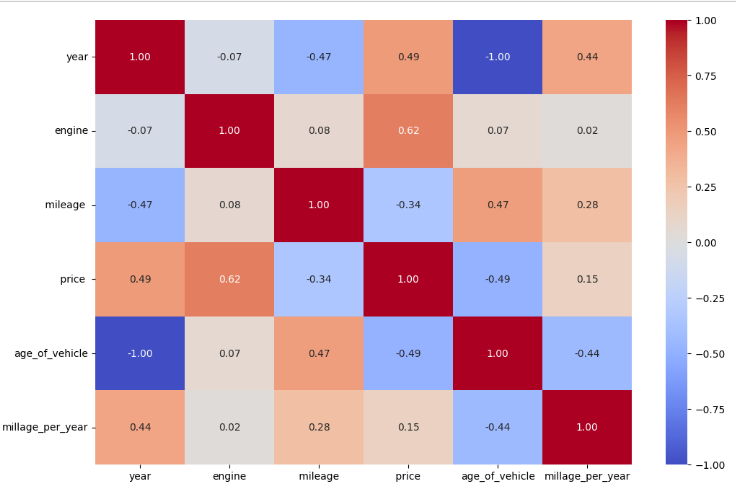
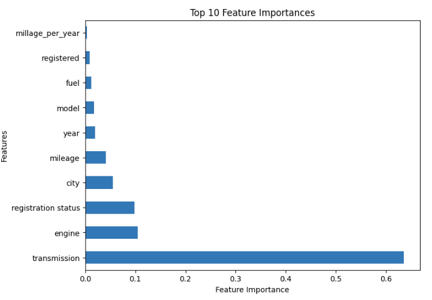

- [XGBOOST \& LightGBM for price prediction](#xgboost--lightgbm-for-price-prediction)
  - [Important Libraries](#important-libraries)
  - [Feature selection with Correlation Matrix](#feature-selection-with-correlation-matrix)
  - [Label Encoding](#label-encoding)
  - [Dealing with leading and Trailing spaces](#dealing-with-leading-and-trailing-spaces)
  - [Data Split \& Noramlize](#data-split--noramlize)
- [XGBoost](#xgboost)
  - [Tuning Hyper Parameters](#tuning-hyper-parameters)
  - [important Features](#important-features)
- [LightGBM](#lightgbm)
  - [Create the Model](#create-the-model)

---

# XGBOOST & LightGBM for price prediction

XGBoost (eXtreme Gradient Boosting) and LightGBM are prominent gradient boosting frameworks used for price prediction. XGBoost is known for its speed, regularization, and flexibility, making it efficient for large datasets. LightGBM, on the other hand, excels in speed and memory efficiency through histogram-based learning. Both frameworks leverage ensemble learning, utilizing decision trees sequentially to learn patterns from historical price data and relevant features, enabling accurate predictions for pricing in various domains. The choice between XGBoost and LightGBM depends on dataset size, computational resources, and the specific needs of the prediction task.

>**[Access Visualization from here](https://public.tableau.com/views/UsedCarsPriceinPakistan/Dashboard1?:language=en-US&:display_count=n&:origin=viz_share_link)**

>**[Click here to see EDA & Analysis](https://github.com/Ihtishammehmood/Python/tree/8918db401bfdd7eadba57dd192e65516f1c8b537/Data%20Aanalysis%20with%20python)**

**[Access Dataset from here](https://www.kaggle.com/datasets/talhabarkaatahmad/pakistan-used-car-prices-2023)**


## Important Libraries

``````python
import numpy as np 
import pandas as pd
from sklearn.model_selection import train_test_split
from sklearn.preprocessing import StandardScaler
from sklearn.metrics import mean_squared_error
from sklearn.neural_network import MLPRegressor
from sklearn.preprocessing import LabelEncoder 


import warnings
warnings.filterwarnings('ignore')
warnings.filterwarnings('ignore', category=DeprecationWarning)
warnings.filterwarnings('ignore', category=FutureWarning)
import xgboost as xgb
``````

Data wrangling and analysis has been done already. Now its time to work on data preprocessing before implementing the models

## Feature selection with Correlation Matrix

The goal of this code is to remove features that exhibit a high correlation (above a specified threshold of 0.8) with other features. First, it calculates the correlation matrix for numerical columns in the DataFrame using Pearson correlation coefficients. The corr() function computes this matrix.


``````python
## Feature Selection
correlation_matrix = df.select_dtypes(include='number').corr()

threshold = 0.8
corr_features = set()

for i in range(len(correlation_matrix.columns)):
    for j in range(i):
        if abs(correlation_matrix.iloc[i, j]) > threshold:
            colname = correlation_matrix.columns[i]
            corr_features.add(colname)

df.drop(corr_features, axis=1, inplace=True)

# Visualize the correlation matrix 
import seaborn as sns
import matplotlib.pyplot as plt

plt.figure(figsize=(12, 8))
sns.heatmap(correlation_matrix, annot=True, cmap='coolwarm', fmt='.2f')
plt.show()
``````

Next, it iterates through the correlation matrix, identifying pairs of features with a correlation magnitude greater than the threshold. For each pair exceeding the threshold, it adds the feature with higher index (column) to a set called corr_features. This set will contain features that need to be removed due to high correlation with other features.

After identifying the correlated features, it drops them from the DataFrame using df.drop() along the columns (axis=1).

Finally, the code visualizes the  correlation matrix after removal of highly correlated features as a heatmap using seaborn and matplotlib. The heatmap color-codes the correlation coefficients, providing a visual representation of the correlation relationships between features. This visualization helps in understanding the strength and direction of correlations, aiding in the interpretation of the feature selection process based on correlation.



## Label Encoding

Label encoding is a technique used to convert categorical data into numerical format, making it compatible for machine learning algorithms. In this process, each unique category in a categorical feature is assigned a unique numerical label. For instance, if we have categories like 'red,' 'green,' and 'blue,' we might assign them labels 0, 1, and 2, respectively. However, it's important to note that label encoding introduces ordinal relationships between categories, which might be misleading to the model. For categories without a natural ordering, it's better to use techniques like one-hot encoding to represent them without implying any hierarchy. Label encoding is quick and simple, making it a commonly used preprocessing step in data preparation for machine learning tasks.
The following code is used to encode the the dataset

``````python


le = LabelEncoder()
df['city'] = le.fit_transform(df[['city']])
df['make'] = le.fit_transform(df[['make']])
df['transmission'] = le.fit_transform(df[['transmission']])
df['registered'] = le.fit_transform(df[['registered']])
df['registration status'] = le.fit_transform(df[['registration status']])
df['fuel'] = le.fit_transform(df[['fuel']])
df['color'] = le.fit_transform(df[['color']])
df['model'] = df['model'].astype(str)
df['model'] = le.fit_transform(df[['model']])
``````

## Dealing with leading and Trailing spaces

``````python
df.columns = df.columns.str.strip()
``````

The code df.columns = df.columns.str.strip() is used to remove leading and trailing spaces from the column names (headers) in a DataFrame (df). This operation is beneficial for ensuring consistency and avoiding issues related to accidental white spaces in column names, which might hinder subsequent data manipulation, analysis, or querying of the DataFrame. By applying str.strip() to each column name, any extraneous spaces at the beginning or end of the names are eliminated, resulting in clean and standardized column labels within the DataFrame.

## Data Split & Noramlize

``````python
x = df.drop(['price'],axis =1)
y = df['price']
``````
x contains the independent variables and y contains the target variable

``````python
X_norm = df.drop(['year','price'],axis =1)

## normalize the data
from sklearn.preprocessing import MinMaxScaler
scaler  =MinMaxScaler()
df_scaled = scaler.fit_transform(X_norm)
X_norm = pd.DataFrame(df_scaled, columns=X_norm.columns)

x = pd.concat([x['year'], X_norm], axis=1)
``````
This code separates the DataFrame df into x (independent variables) by excluding the 'price' column, and y (dependent or target variable), which is the 'price' columns and then  performs feature normalization using Min-Max scaling. It first selects the features for normalization, excluding 'year' and 'price' columns. Then, it uses the MinMaxScaler from scikit-learn to scale the selected features to a specified range (usually [0, 1]). Finally, the scaled features are stored in a DataFrame called X_norm.
The 'year' column, initially stored in x, is concatenated with the normalized features (X_norm) along the columns (axis=1). This combines the 'year' information with the normalized features, creating the final set of independent variables x for further analysis.

Overall, this code prepares the data by splitting features and target, normalizing the features (excluding 'year' and 'price'), and then concatenating the normalized features with the 'year' column to create the final set of features for modeling.

``````python
x_train, x_test , y_train, y_test = train_test_split(x,y, test_size = 0.1,random_state=42)
``````
This code utilizes the train_test_split function from a machine learning library, scikit-learn, to split the data into training and testing sets for both features (x) and the target (y) which code efficiently partitions the dataset into training and testing sets, facilitating the subsequent training and evaluation of machine learning models. The training set (x_train and y_train) is used to train the model, and the testing set (x_test and y_test) is employed to evaluate its performance and generalization to unseen data.

# XGBoost

``````python
model = xgb_regressor = xgb.XGBRegressor(objective='reg:squarederror', n_estimators=200, max_depth=6, random_state=42)

model.fit(x_train, y_train)
``````

In this code snippet, we are creating and training a predictive model using XGBoost, a popular gradient boosting framework. First, we define our model using xgb.XGBRegressor(). This sets up an instance of the XGBoost Regressor, specifying our objective as 'reg:squarederror,' indicating that we're aiming to minimize the mean squared error during training. We set the number of estimators (trees) to 200, controlling the complexity of the model, and the maximum depth of each tree to 6, which helps prevent overfitting. Additionally, we set the random state to 42 to ensure reproducibility of results.

Next, we proceed to train our model using the fit method. We provide the training features (x_train) and their corresponding target values (y_train) to the fit function. This process involves the model learning the patterns and relationships in the training data, enabling it to make accurate predictions for unseen data.

## Tuning Hyper Parameters

``````python
param_grid ={'learning_rate':[0.05,0.1,0.2],
            'max_depth':[3,5,7],'n_estimators':[50,100,200],
             'num_leaves':[31, 63, 127, 255], 'max_depth':[-1, 3, 5, 7]
            }
``````
In this code, param_grid defines a grid of hyperparameters for tuning a LightGBM model. It includes different values for key parameters like learning rate, maximum depth of trees, number of estimators (trees), number of leaves, and maximum depth (with -1 indicating no limit). The purpose is to explore various combinations of these hyperparameter during the model tuning process, optimizing the model's performance for the given task. This hyperparameters grid aids in finding the best configuration for the LightGBM model, ultimately improving its predictive accuracy and robustness.

``````python
from sklearn.model_selection import GridSearchCV

## initialize the grid search
grid_search = GridSearchCV(model,param_grid , cv = 5, n_jobs = -1) 
``````
The GridSearchCV will perform a cross-validated grid search using the provided parameter grid (param_grid). It splits the data into 5 folds for cross-validation (cv=5), meaning it will evaluate each combination of hyperparameters five times, using a different fold for validation each time. The n_jobs=-1 parameter allows the search to be parallelized, leveraging all available CPU cores for faster processing.

Ultimately, this grid search will help us identify the best combination of hyperparameters for our XGBoost Regressor model based on the evaluation metric specified (often mean squared error for regression tasks). This fine-tuning aims to enhance the model's predictive performance and generalize well to unseen data.

``````python
## train the best model

best_model.fit(x_train, y_train)
``````
In this code, we're training the machine learning model with the best set of hyperparameters identified through the earlier grid search. After conducting a thorough search over various hyperparameter combinations using GridSearchCV, we've determined the optimal configuration for our model.

``````python
y_pred = best_model.predict(x_test)

mse = mean_squared_error(y_test , y_pred)
``````

we're using our tuned model (best_model) to predict the target values (y_pred) for the test set (x_test). We then calculate the mean squared error (mse) to quantify the prediction accuracy by comparing the predicted values (y_pred) against the actual test values (y_test). This metric helps us assess how well our model performs on unseen data, providing a measure of predictive effectiveness.

``````python
from sklearn.metrics import mean_squared_error, mean_absolute_error, r2_score
mse = mean_squared_error(y_test, y_pred)
rmse = np.sqrt(mse)
mae = mean_absolute_error(y_test, y_pred)
r_squared = r2_score(y_test, y_pred)
``````
In this code, we're evaluating our model's performance using common regression metrics. We first calculate the mean squared error (mse) to quantify the prediction accuracy, followed by computing the root mean squared error (rmse) for a more interpretable measure. Additionally, we determine the mean absolute error (mae) to gauge the prediction accuracy in a different perspective. Finally, we calculate the R-squared (r_squared) value, which provides insights into how well our model fits the data, conveying the proportion of variance in the target variable explained by the features. These metrics collectively offer a comprehensive view of our model's predictive capabilities and its alignment with the true target values.

**The results are as follows:**

Mean Squared Error (MSE): 231761848891.70505

Root Mean Squared Error (RMSE): 481416.50251285016

Mean Absolute Error (MAE): 278907.4528850518

R-squared (R²): 0.9609000365264161

``````python
from sklearn.metrics import explained_variance_score
print(explained_variance_score(y_pred,y_test))
``````
we're using the explained_variance_score from scikit-learn to calculate the explained variance of our predictions (y_pred) compared to the actual target values (y_test). The explained variance score indicates the proportion of variance in the target variable that our model's predictions explain. It provides a measure of the model's ability to capture the underlying patterns and variability in the data, with higher values indicating a better fit. By printing this score, we gain insights into how well our model accounts for the variance in the target variable.

Result: **0.9590632147449937**

## important Features

``````python
import matplotlib.pyplot as plt

# Feature importances plot
plt.figure(figsize=(8, 6))
feature_importances = pd.Series(model.feature_importances_, index=x.columns)
feature_importances.nlargest(10).plot(kind='barh')
plt.xlabel('Feature Importance')
plt.ylabel('Features')
plt.title('Top 10 Feature Importances')
plt.show()
``````



In this particular image we can clearly see some top 10  important features. This visualization helps us understand which features have the most significant influence on our model's predictions, aiding in feature selection and model interpretation.


# LightGBM

The process for Light GBM is same as the XGBOOST. The steps are as follows:


## Create the Model

``````python
# Create the LightGBM Regressor model
lgbm = LGBMRegressor(n_estimators=1000, learning_rate=0.01, num_leaves=31, max_depth=-1)

# Train the model on the training set
lgbm.fit(x_train, y_train)
``````

1. **Initialize the grid search**

``````python

grid_search = GridSearchCV(lgbm,param_grid , cv = 5, n_jobs = -1)
`````` 

2. **Fit the grid search cv**

``````python
grid_search.fit(x_train, y_train)
``````

3. **Get best parameters and best model**

``````python
best_params = grid_search.best_params_
best_model = grid_search.best_estimator_
``````

4. **Train the best model**

``````python
best_model.fit(x_train, y_train)
``````

5. **Model Evaluation**

``````python
y_pred = best_model.predict(x_test)

mse = mean_squared_error(y_test , y_pred)

from sklearn.metrics import mean_squared_error, mean_absolute_error, r2_score
mse = mean_squared_error(y_test, y_pred)
rmse = np.sqrt(mse)
mae = mean_absolute_error(y_test, y_pred)
r_squared = r2_score(y_test, y_pred)

print('Mean Squared Error (MSE):', mse)
print('Root Mean Squared Error (RMSE):', rmse)
print('Mean Absolute Error (MAE):', mae)
print('R-squared (R²):', r_squared)
``````

**Results:**

Mean Squared Error (MSE): 239113435514.25488

Root Mean Squared Error (RMSE): 488992.2652908274

Mean Absolute Error (MAE): 277097.64916909754

R-squared (R²): 0.9596597686834162

``````python
from sklearn.metrics import explained_variance_score
print(explained_variance_score(y_pred,y_test))
``````

Results:
**0.9575604740088568**

----


