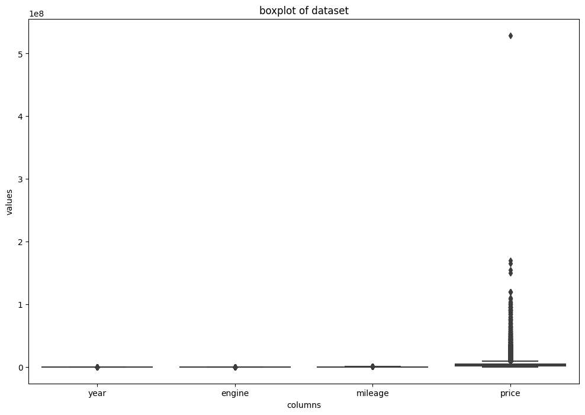
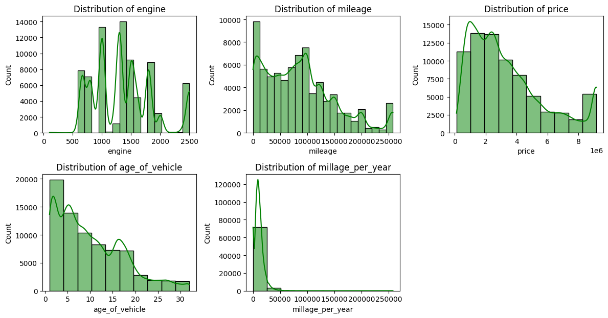
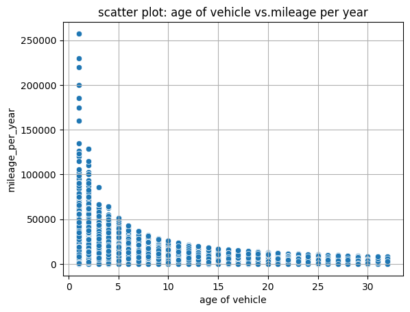
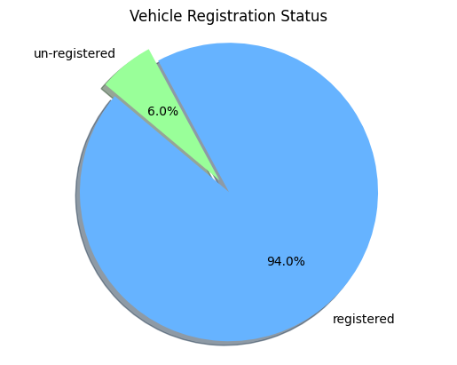
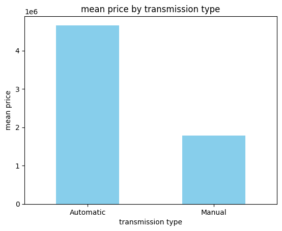
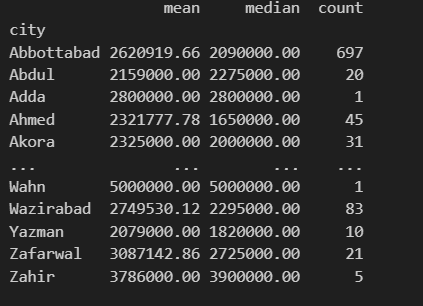

- [Data Analysis with python](#data-analysis-with-python)
  - [Data Wrangling](#data-wrangling)
    - [Understand the Structure of the Data](#understand-the-structure-of-the-data)
    - [drop duplicates](#drop-duplicates)
    - [look for null Values](#look-for-null-values)
    - [Outlier Detection](#outlier-detection)
    - [Data Conversion](#data-conversion)
    - [Feature Engineering](#feature-engineering)
    - [Data Distribution](#data-distribution)
  - [Data Analysis](#data-analysis)
    - [How is the distribution of vehicles by 'make' and 'model' in the dataset?](#how-is-the-distribution-of-vehicles-by-make-and-model-in-the-dataset)
    - [What are the most common 'colors' of vehicles in the dataset?](#what-are-the-most-common-colors-of-vehicles-in-the-dataset)
    - [How does the 'price' vary based on the 'make' of the vehicle?](#how-does-the-price-vary-based-on-the-make-of-the-vehicle)
    - [Is there a correlation between 'age\_of\_vehicle' and 'price'?](#is-there-a-correlation-between-age_of_vehicle-and-price)
    - [Is there a correlation between 'age\_of\_vehicle' and 'mileage\_per\_year'?](#is-there-a-correlation-between-age_of_vehicle-and-mileage_per_year)
    - [What percentage of vehicles are registered in the dataset?](#what-percentage-of-vehicles-are-registered-in-the-dataset)
    - [How does the 'price' vary for different 'transmission' types?](#how-does-the-price-vary-for-different-transmission-types)
    - [How does the 'price' vary in different cities?](#how-does-the-price-vary-in-different-cities)


---
# Data Analysis with python

Data analysis in Python is of paramount importance in today's data-driven world. Python's robust ecosystem of libraries and tools, such as Pandas, NumPy, SciPy, and Matplotlib, empowers analysts to efficiently process, clean, manipulate, and visualize vast and diverse datasets. Through Python, data analysts can extract valuable insights, patterns, and trends from raw data, enabling informed decision-making and strategic planning. The versatility of Python allows for seamless integration with machine learning algorithms, aiding predictive modeling and advancing businesses in optimizing operations, enhancing user experiences, and staying competitive in an evolving market landscape. In essence, Python's role in data analysis extends far beyond data processing; it underpins the transformation of raw data into actionable knowledge, which is essential for driving innovation and achieving organizational goals.

## Data Wrangling

Data wrangling, also known as data cleaning, data munging, or data remediation, is the process of transforming and mapping data from one "raw" data form into another format with the intent of making it more appropriate and valuable for a variety of downstream purposes such as analytics.

Data wrangling is an essential part of the data science workflow, as it helps to ensure that the data is accurate, complete, and consistent. This is important because the quality of the data has a direct impact on the quality of the analysis and insights that can be generated from it.

There are following steps steps that are compulsory to take before getting into data analysis process

``````python
import pandas as pd
import numpy as np
import seaborn as sns
import matplotlib.pyplot as plt
import warnings
warnings.filterwarnings("ignore", category=FutureWarning)

df = pd.read_csv(r'C:\Users\UMER COMPUTERS\Desktop\DataRead\used cars.csv')
``````

in these following lines of code the important libraries are being imported as well as  [Data related to used cars prices](https://www.kaggle.com/code/talhabarkaatahmad/pakistan-used-car-data-2023)


1. ## Data Exploration
   

Data exploration in Python is a crucial phase in the data analysis process that involves understanding and getting insights from the dataset at hand. It encompasses various techniques to summarize, visualize, and understand the underlying patterns and characteristics of the data. Below are the typical steps involved in data exploration:

 ### Understand the Structure of the Data

``````python
df.info()
df.describe()
df.head()
df.shape()
``````
Explore the structure of the dataset by examining the dimensions (number of rows and columns), data types, and the first few rows. Use functions like shape, info, and head in Pandas.

### drop duplicates

``````python
df.drop_duplicates(inplace=True)
``````
This code snippet helps to look for duplicates in the DataFrame and drops it

### look for null Values

Identify and handle missing or null values in the dataset using functions like isnull, fillna, or dropna in Pandas. Understanding the extent of missing data is critical for subsequent analysis.

``````python
## looking for null values
df.isnull().sum()

## dropping columns with high null values count
colum_drop = ['addref','assembly','body']
df = df.drop(columns=colum_drop)

## filling year null value with interpolation method
df['year'] = df['year'].interpolate(method='linear')

##droping rows with missing values
df= df.dropna()
``````
In these following lines of code first code looks for total number of null values in the DataFrame

columns | Null count
------- | -------
addref | 0
city | 0
assembly | 53689
body | 8904
make | 0
model | 0
year | 4779
engine | 3
transmission | 0
fuel | 906
color | 1480
registered | 0
mileage | 0
price | 583

by looking at this we can see there are too many null values in the DataFrame. 

``````python
## dropping columns with high null values count
colum_drop = ['addref','assembly','body']
df = df.drop(columns=colum_drop)
``````

Dropping some unimportant columns in the  DataFrame. 'addref' is a unique identity columns which has no importance in data analysis while other two columns 'assembly' and 'body' are the columns with most null values in it

``````python
## filling year null value with interpolation method
df['year'] = df['year'].interpolate(method='linear')
``````

This interpolation technique very useful to fill null values.interpolation is a technique in Python with which you can estimate unknown data points between two known data points. It is commonly used to fill missing values in a table or a dataset using the already known values.

``````python
##droping rows with missing values
df= df.dropna()
``````

The columns with minor missing values better be dropped as it will not impact the  over data

``````python
## checking the shape of data
df.shape
``````
Now this is the shape of the data after getting rid of all the null values and dropping columns

(74979, 11) \
columns = 11 \
Rows = 74979


### Outlier Detection

Identify outliers in the dataset, as they can significantly impact the analysis. Visualizations like box plots or statistical methods can help in detecting and handling outliers appropriately.

``````python
numerical_cols  =df.select_dtypes(include='number')
plt.figure(figsize=(12,8))
sns.boxplot(data=numerical_cols)
plt.title('boxplot of dataset')
plt.xlabel('columns')
plt.ylabel('values')
``````
This python code is used to check the outliers i  each numerical values and draws the boxplot for the visual display of outliers




by the look this section we can see that there are outliers in the DataSet which can cause a problem to deal with the outlier we will use the [IQR](https://www.geeksforgeeks.org/interquartile-range-to-detect-outliers-in-data/) method

``````python
def find_outliers_iqr(series):
    Q1 = series.quantile(0.25)
    Q3 = series.quantile(0.75)
    IQR = Q3 - Q1
    lower_bound = Q1 - 1.5 * IQR
    upper_bound = Q3 + 1.5 * IQR
    outliers = (series < lower_bound) | (series > upper_bound)
    return outliers

def cap_outliers_in_dataframe(df):
    capped_df = df.copy()

    for column in capped_df.columns:
        if np.issubdtype(capped_df[column].dtype, np.number):  # Check if the column contains numeric data
            outliers = find_outliers_iqr(capped_df[column])

            # Cap the outliers by replacing them with lower/upper bounds
            Q1 = capped_df[column].quantile(0.25)
            Q3 = capped_df[column].quantile(0.75)
            IQR = Q3 - Q1
            lower_bound = Q1 - 1.5 * IQR
            upper_bound = Q3 + 1.5 * IQR

            capped_df[column] = np.where(outliers, np.clip(capped_df[column], lower_bound, upper_bound), capped_df[column])

    return capped_df

capped_df = cap_outliers_in_dataframe(df)

# Print the DataFrame with capped values
print(capped_df)
``````
This code defines two functions for handling outliers in a DataFrame using the interquartile range (IQR) method. The first function, find_outliers_iqr, identifies outliers in a given numerical series by calculating the lower and upper bounds based on the IQR and flags values falling outside these bounds as outliers. The second function, cap_outliers_in_dataframe, iterates through the columns of a DataFrame, identifies outliers using the IQR method, and caps these outliers by replacing them with the corresponding lower or upper bound defined by the IQR.

The main process involves calculating the quartiles and IQR for each numerical column in the DataFrame. Outliers are then identified using the IQR method, and if an outlier is found, it is replaced with the appropriate bound to cap the value. This approach helps mitigate the impact of outliers on subsequent analysis by ensuring that extreme values are brought within a reasonable range. The resulting DataFrame, capped_df, contains the original data with outliers capped to the computed bounds.


``````python
## checking for oultliers after cap
numerical_cols  =capped_df.select_dtypes(include='number')
plt.figure(figsize=(12,8))
sns.boxplot(data=numerical_cols)
plt.title('boxplot of dataset')
plt.xlabel('columns')
plt.ylabel('values')
``````


The Data looks clean now as there are not outliers left to effect he analysis

### Data Conversion 

``````python
## convert to int
float_columns = ['year','engine']
capped_df[float_columns] = capped_df[float_columns].astype('int')
``````

 this code segment facilitates the transformation of specific columns from floating-point to integer data type, aligning them with the appropriate data representation for the given context.


 ### Feature Engineering

 Create new features or modify existing ones based on  analysis insights. Feature engineering is essential for improving model performance and deriving meaningful patterns from the data.

``````python
## calculating age of the car
reference_year = 2023
capped_df['age_of_vehicle'] = reference_year - capped_df['year']

## calculate the milage per year
capped_df['millage_per_year'] = capped_df['mileage'] / capped_df['age_of_vehicle']
``````

In this code snippet, the age of each vehicle in the DataFrame is calculated by subtracting the manufacturing year ('year' column) from a reference year (assumed as 2023). This provides the 'age_of_vehicle' for each entry, representing how many years old each car is based on the given reference year. Additionally, the code calculates the mileage per year for each vehicle ('millage_per_year') by dividing the 'mileage' by the previously computed 'age_of_vehicle'. This calculation offers insights into the average distance traveled by each car per year, a valuable metric for understanding vehicle usage patterns and efficiency. Overall, these calculations enhance the dataset by providing crucial information related to the age and usage of the vehicles, which can be further utilized for analysis and decision-making.

### Data Distribution

``````python
plt.figure(figsize=(12,9))

plt.subplot(3, 3, 1)
sns.histplot(data=capped_df, x='engine', bins=20, kde=True,color='green')
plt.title('Distribution of engine')


plt.subplot(3, 3, 2)
sns.histplot(data=capped_df, x='mileage', bins=20, kde=True,color='green')
plt.title('Distribution of mileage')


plt.subplot(3, 3, 3)
sns.histplot(data=capped_df, x='price', bins=10, kde=True,color='green')
plt.title('Distribution of price')

plt.subplot(3, 3, 4)
sns.histplot(data=capped_df, x='age_of_vehicle', bins=10, kde=True,color='green')
plt.title('Distribution of age_of_vehicle')

plt.subplot(3, 3, 5)
sns.histplot(data=capped_df, x='millage_per_year', bins=10, kde=True,color='green')
plt.title('Distribution of millage_per_year')


plt.tight_layout()
plt.show()
``````

This python code will help to look into the distribution of numerical data





 ## Data Analysis

### How is the distribution of vehicles by 'make' and 'model' in the dataset?

``````python
make_distribution = capped_df['make'].value_counts()

model_distribution =capped_df['model'].value_counts()

print("Distribution of vehicles by 'make':")
print(make_distribution.head(5))

print("Distribution of vehicles by 'model':")
print(model_distribution.head(5))
``````

This code computes the distribution of vehicles based on their 'make' and 'model' attributes in the DataFrame. It uses the value_counts() method to count the occurrences of each unique value in the 'make' and 'model' columns, resulting in the number of vehicles associated with each make and model. The results are then displayed for the top 5 makes and models in terms of vehicle count, offering an overview of the most prevalent makes and models in the dataset. This information can be valuable for understanding the dataset's composition and can inform further analysis or decision-making related to specific vehicle brands and models.


**Make**
Make | numbers
------- | -------
Toyota | 23893
Suzuki | 21606
Honda | 16010
Daihatsu | 2999
KIA | 1705

**Model**

Model | Number
------- | -------
Corolla | 12446
Civic | 8057
City | 5184
Mehran | 4419
Cultus | 4353

### What are the most common 'colors' of vehicles in the dataset?

``````python
color_counts = capped_df['color'].value_counts()

print('most common color of vehicle:')
print(color_counts.head())
``````

most common color of vehicle:

Colors | numbers
------- | -------
White | 20948
Silver | 8031
Black | 6822
Grey | 4084
Solid White | 4016

``````python
pd.set_option('display.float_format', '{:.2f}'.format)
``````

This code snippet helps to convert the [scientific notation](https://byjus.com/maths/scientific-notation/) into simple numerical formant for easy understanding

### How does the 'price' vary based on the 'make' of the vehicle?

``````python
price_by_make = capped_df.groupby('make')['price'].mean()

# Display the mean price for each 'make'
print("Mean price by vehicle make:")
print(price_by_make.sort_values(ascending=False))
``````
In this code snippet, the average price of vehicles is calculated based on their respective 'make'. The DataFrame is grouped by the 'make' column, and the mean price for each make is computed using the mean() function for the 'price' column. The resulting mean prices are then displayed in descending order, providing insights into the average price associated with each vehicle make. This information can be highly useful for understanding pricing trends and variations across different vehicle manufacturers, aiding pricing strategies or market analysis.

Make | Price
------- | -------
Dodge | 9155000.00
Hummer | 9155000.00
Bentley | 9155000.00
Chrysler | 9155000.00
BAIC | 9075566.04
 | ... |               
Chevrolet | 1078104.76
Datsun | 662647.06
Roma | 550000.00
Daewoo | 471898.31
Fiat | 436666.67

And list goes on...

### Is there a correlation between 'age_of_vehicle' and 'price'?

``````python
correlation  = capped_df['age_of_vehicle'].corr(capped_df['price'])
print("correlation between 'age_of_vehicle' and 'price'",  correlation)
``````

This code helps to see the correlation between two variables like 'age_of_vehicle' and 'price'

>**correlation between 'age_of_vehicle' and 'price': -0.49001639423336296**


The correlation is negative which means increase the age of vehicle will reduce the price of vehicle. 

A correlation coefficient of zero indicates that no linear relationship exists between two continuous variables, and a correlation coefficient of −1 or +1 indicates a perfect linear relationship. The strength of relationship can be anywhere between −1 and +1.


### Is there a correlation between 'age_of_vehicle' and 'mileage_per_year'?

``````python
correlation = capped_df['age_of_vehicle'].corr(capped_df['millage_per_year'])
print('correlation is:',correlation)
# creating a scatter plot
sns.scatterplot(data=capped_df,x = 'age_of_vehicle', y='millage_per_year')
plt.xlabel('age of vehicle')
plt.ylabel('mileage_per_year')
plt.title('scatter plot: age of vehicle vs.mileage per year')
plt.grid(True)
plt.show()
``````
This code helps to see the relation of 'age of vehicle' and 'Mileage per year' with the help of scatter plot




With the help of this scatter plot we can assume that as the  the 'age of vehicle' is increasing the 'mileage per year' is decreasing. 


###  What percentage of vehicles are registered in the dataset?

``````python
total_count = len(capped_df)
print(total_count)

unregistered_count = (capped_df['registered'] =='Un-Registered').sum()
registered_count = total_count-unregistered_count

## creating percentage
un_registered_percentage = (unregistered_count /total_count ) *100
registered_percentage =  (registered_count /total_count ) *100

## create a pie chart
labels = ['registered','un-registered']
sizes = [registered_percentage,un_registered_percentage]
colors = ['#66b3ff', '#99ff99']
explode = (0.1,0)
plt.pie(sizes,explode=explode,labels=labels,colors=colors,autopct='%1.1f%%',shadow=True,
       startangle=140 )
plt.axis('equal')
plt.title('Vehicle Registration Status')
plt.show()
``````

This code calculates and visualizes the distribution of registered and unregistered vehicles in a DataFrame. First, it computes the total count of vehicles in the DataFrame using len(capped_df) and prints this count. Then, it determines the count of unregistered vehicles by filtering the DataFrame based on the 'registered' column and counting the occurrences where the registration status is 'Un-Registered'. The count of registered vehicles is calculated by subtracting the unregistered count from the total count.

Next, it computes the percentages of registered and unregistered vehicles by dividing their respective counts by the total count and multiplying by 100 to get the percentages. These percentages are then used to create a pie chart using Matplotlib. The chart visually represents the proportion of registered and unregistered vehicles, with appropriate labels, colors, and percentage display on the chart slices. The pie chart helps visualize the vehicle registration status distribution, providing insights into the dataset's composition and potentially informing decisions related to vehicle registration strategies or policies.




According the Dataset, most of the cars are registered. Only 6 % are non custom cars

### How does the 'price' vary for different 'transmission' types?

``````python
mean_price_by_transmission = capped_df.groupby('transmission')['price'].mean()

# #plotting a bar-plot
mean_price_by_transmission.plot(kind='bar',color='skyblue')
plt.xlabel('transmission type')
plt.ylabel('mean price')
plt.title('mean price by transmission type')
plt. xticks(rotation = 0)
plt.show()

``````



The automatic cars are much  expensive compare to the manual cars in the dataset


### How does the 'price' vary in different cities?

``````python
summary_statistics = capped_df.groupby('city')['price'].agg(['mean','median','count'])
print(summary_statistics)
``````
In this code, summary statistics related to the 'price' column are calculated for each unique 'city' in the DataFrame. The DataFrame is grouped by the 'city' column, and the agg function is used to compute the mean, median, and count of prices for each city. The resulting summary statistics provide valuable insights into the price distribution within different cities. The 'mean' represents the average price, the 'median' represents the middle value when the prices are arranged in order, and 'count' indicates the number of entries for each city. Analyzing these summary statistics can help understand price trends and variations across different cities, aiding in market analysis or pricing strategies specific to various locations.



